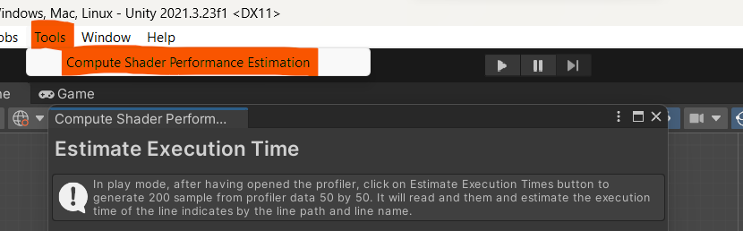
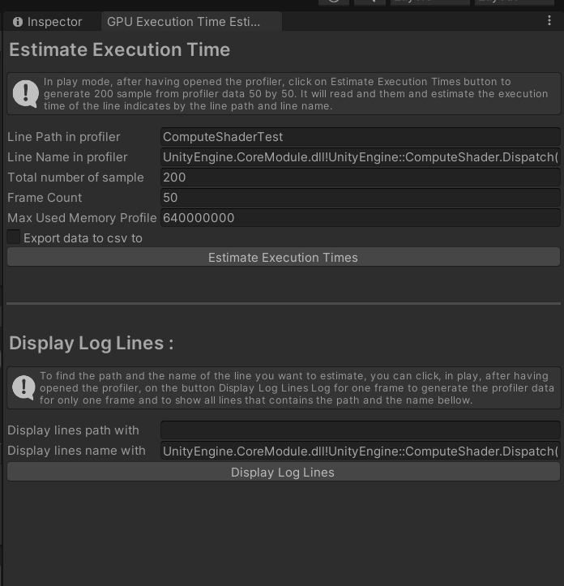
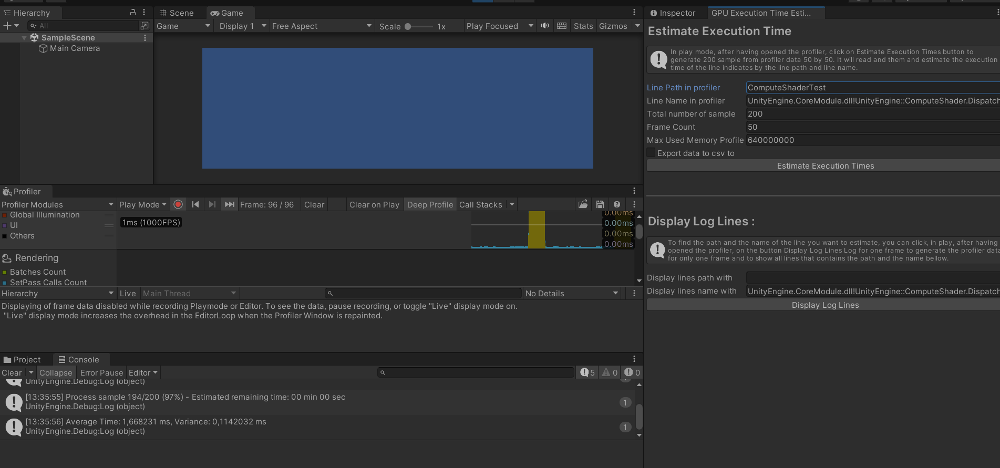

# Tools Compute Shader Performances Estimation

Welcome to the Compute Shader Performance Estimation package for Unity! This tool is designed to help you estimate the performance of compute shaders in your Unity projects by retrieving and analyzing profiler data.
Although slow, it gives a good idea of the average execution time of a compute shader without having to code anything.

## Installation

1. In Unity click on `Windows\Package Manager`.
2. Click on the `+` on the top left of the windows and `Add Package from git URL` 
3. Paste the URL of this git `https://github.com/davidAlgis/com.studio-nyx.compute-shader-performance-estimation.git` in the input field and wait for the installation to be done.

## Estimate The Performance of a Compute Shader

To open the Compute Shader Performance Estimation dedicated window click on `Tools\Compute Shader Performance Estimation`. 

Once you have set up in the windows the name and the path of your compute shader in the profiler, you can set the desired number of sample for average calculation and then you just have to click on the `Estimate Execution Times` button.

The tool will then compute the average and variance of the execution time of the compute shader from the profiler data based on your settings and estimate the execution time of the specified line. The result is displayed in the log.

 
## Settings Search

1. **Line Path**: Specify the path in the profiler for the line you want to estimate. This is defined by all the namespace/functions parents of the call you want to estimate. If you don't know what to use here, you can use the `Display Log Lines` which will display the list of line in profiler which contains a given path and name (see dedicated section bellow).

2. **Line Name**: Input the name of the line in the profiler that you want to estimate. For compute shader kernel execution, use: `UnityEngine.CoreModule.dll!UnityEngine::ComputeShader.Dispatch()`. Avoid using just `ComputeShader.Dispatch()` as it might be associated with a child line and show a duration of 0 ms. If you don't know what to use here, you can use the `Display Log Lines` which will display the list of line in profiler which contains a given path and name (see dedicated section bellow).

3. **Total Number of Samples**: Set the number of samples for average time calculation. Be cautious with large projects as increasing this value significantly can lead to memory issues.

4. **Frame Count**: Define the number of frames that will be saved and read in the profiler. This is limited by the memory consumption of your project.

5. **Max Used Memory Profiler**: Adjust the maximum memory usage for the profiler, especially for larger projects. The default value used by Unity is 64 MB.

6. **CSV Export**: Optionally, you can choose to export the data to a CSV file by checking the 'Export data to csv to' option and specifying a file path. In tools folder of the package there is a python script `plotEstimationTime.py` to display a simple visualization of the data with `matplotlib`.

## Displaying Log Lines

To assist in finding the correct line path and name:

1. Click on the `Display Log Lines` button.
2. This will generate profiler data for a single frame and show all lines that contain the specified path and name.

## Example 

The capture bellow show an example of the performance estimation of a kernel called from a function named `ComputeShaderTest`. The average has been calculated from 200 sample, which has been split by retrieving four times 50 frames of profiler. 

## Notes

- Ensure that Unity is in play mode and the profiler is open while using this tool.
- Be mindful of memory usage when dealing with large projects or when setting high sample counts.

# Support

If you encounter any issues or have questions regarding the usage of this tool, please feel free to open an issue in the repository.

# Meta

This repository has been developed within the scopes of the thesis of David Algis in collaboration with XLIM and Studio Nyx..
